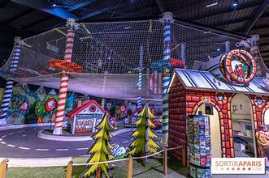

# Miniature

Miniature is a whimsical, web-based experience inspired by the charm of indoor fantasy parks and miniature villages. It’s designed to capture the imagination of children and families through playful visuals and interactive elements.

## Features
- Colorful, cartoon-style UI inspired by real-life play areas
- Simple navigation like a toy-town map
- Ideal for showcasing kids’ events, parks, or creative spaces

## Technologies
- HTML
- CSS (with playful styling)
- Optional: JavaScript (for interactive elements)

## Preview

## How to Use
Download or clone the repo and open `index.html` in your browser to explore the miniature world.

---
Let your imagination run tiny! 🏡🌲🎠
